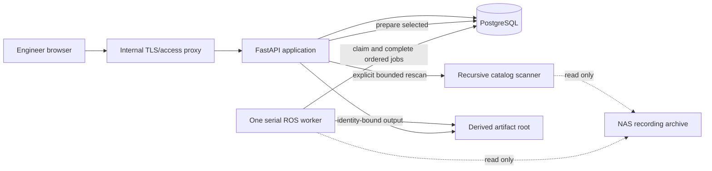

# ROS 2 Bag Analyser — V1 Architecture

> **Status:** Approved V1 build contract; Building blocks 1 and 2
> and their corrective slices accepted; Building block 3 repository readiness
> implemented, verified, and accepted as the working baseline on 2026-08-23;
> Prompt 2A and read-only CIFS compatibility reviewed and committed locally on
> 2026-08-24; front-preview-v3 all-zero-header corrective slice implemented
> synthetically and awaiting review; controlled live commissioning in progress
>
> **Target:** Internal limited-group NAS trial
>
> **Last updated:** 2026-09-01

## 1. Objective and baseline

V1 makes the completed V0 processing and synchronized review capabilities
usable as one coherent product workflow against a larger, physically organized
NAS archive.

V1 extends the existing modular monolith rather than replacing its processors,
artifact store, worker, or synchronization model. The separately approved
smooth front-camera correction versions only that processor's timing policy and
browser correction behavior. The separately approved moved-path corrections
keep retained source-missing history internal to ordinary current catalog
projections and preserve compatible processed output across unambiguous folder
moves. The primary additions are:

- bounded recursive discovery and a physical folder-tree contract;
- one aggregate preparation state per recording;
- one bounded, selectively scoped bulk preparation operation;
- persistent queue, control, failure, history, elapsed-time, and estimate APIs;
- the frontend under `archive/` wired to real data; and
- a repeatable internal VM deployment.

The V0 documents in [docs/v0](docs/v0/INDEX.md) remain the evidence for source
facts, processor correctness, artifact identity, timing, and real-data safety.

### 1.1 Implemented Prompt 2A architecture delta

Prompt 2A was approved, invoked, implemented, and synthetically verified on
2026-08-23. It owns these corrective changes:

- the current Recordings, Processing, and Analyzer reference replaces the
  served presentation while Experiments/Files and all mock payloads are
  excluded;
- preparation accepts a validated non-empty subset of the same three artifact
  kinds and preserves independently reusable output identity;
- job lifecycle remains durable, while a separate control state supports
  pause/resume and cancellation without confusing a paused attempt with a
  terminal result;
- queue reorder is serialized with worker claim order, and bulk controls are
  bounded, transactional where required, and concurrency-safe;
- processors may publish exact completed/total phase units only at validated
  safe checkpoints; otherwise progress stays indeterminate;
- historical likely duration and cumulative queue estimates remain explicitly
  approximate and disappear when required inputs are unknown or stale; and
- Analyzer graph-window interactions remain presentation over the one factual
  full-recording clock and do not alter media timing, coverage, or artifact
  contracts.

Prompt 2A in `BUILDING_BLOCK_PROMPTS.md` owns the detailed state machine,
migration/API contracts, checkpoint semantics, failure rules, and visual test
matrix. The implementation is committed locally as `1c8871b`; its CIFS
deployment compatibility follows as `dd28c42`. Release installation,
authoritative-source, and screenshot acceptance remain separately gated.

The 2026-08-24 Recordings review restores the separate Recorded table column
using the already-delivered decimal `start_time_ns` catalog fact. Filter menus
and status-tooltip placement are browser presentation only: they add no API,
source read, persistence, job, processor, or timing behavior.

### 1.2 `front-preview-v3` all-zero-header timing correction

`front-preview-v3` adds one narrow timing selection to the existing front
processor. A stream whose every decoded `sensor_msgs/msg/Image` header has
exactly `stamp.sec == 0` and `stamp.nanosec == 0` uses its already measured ROS
database record timestamps as frame presentation cadence. Coverage remains the
first and last retained ROS record timestamps. Duplicate record timestamps
still collapse to the last frame, and distinct record timestamps must remain
ordered and distinct at the configured media timescale.

All other streams retain the exact `front-preview-v2` rule: valid, strictly
increasing header timestamps are affinely mapped between the measured record
endpoints. The new selection is not a generic invalid-header fallback. A
missing header, mixed zero/non-zero stream, negative seconds, invalid
nanoseconds, out-of-range value, unordered non-zero header, degenerate affine
span, or media-timescale collision fails before publication. No frame is
interpolated and no fixed frame rate is fabricated.

The active planner/cache contract includes processor `front-preview-v3` and
timing identity `image_header_affine_or_all_zero_record_timestamp_v3`.
Consequently, V2 artifacts remain historical while V3 artifacts have an
independent reusable identity. A successful all-zero artifact records
`ros_record_timestamp_all_zero_image_headers` provenance and an exact media-PTS
digest; a successful valid-header artifact continues to record the V2 affine
policy and provenance.

## 2. V1 decisions

| Area | V1 decision |
|---|---|
| Product surface | Preserve the `archive/` mockup as the visual contract |
| Shape | Modular monolith in one repository |
| Backend | Python in a ROS 2 Humble-compatible Ubuntu 22.04 environment |
| HTTP | FastAPI with versioned V1 JSON contracts |
| Frontend | Dependency-free HTML, CSS, and JavaScript |
| Metadata | PostgreSQL |
| Source archive | One configured, physically nested, strictly read-only root |
| Derived data | Separate configured writable filesystem root |
| Expensive work | Exactly one serial worker |
| Preparation | One bulk user action, a non-empty chosen subset of three independent artifact jobs |
| Artifact kinds | `front_preview`, `topdown_preview`, `imu_series` |
| Queue order | Stable mutable `queue_order`, shared exactly by display, reorder, insertion, cancellation, and worker claim |
| Job control | Durable pause/resume and cancellation at cooperative safe checkpoints; one serial worker |
| Job progress | Indeterminate unless a processor has an exact completed/total unit pair |
| Estimate | Historical, kind-specific, source-size-normalized, explicitly approximate |
| ROS time | Database record time relative to bag start |
| Front media cadence | V2 affine image-header cadence, or measured ROS record cadence only for a proven all-zero image-header stream (`front-preview-v3`) |
| Top-down time | CSV Unix time relative to bag start |
| Trial deployment | One internal Ubuntu VM with a trusted access boundary |
| Public exposure | Prohibited |

## 3. Non-negotiable invariants

### 3.1 Original recordings are immutable

The application never modifies, repairs, reindexes, truncates, renames, moves,
deletes, or writes beside a source recording. It does not create source-side
journals, WAL files, locks, indexes, caches, or sidecars.

SQLite sources are opened with explicit read-only URI mode and immutable mode
when compatible. A NAS read-only mount and read-only service-account permission
provide defence in depth but do not replace application enforcement.

### 3.2 Derived output has one owner

All generated files live below the configured derived root. Temporary work is
job-owned, contained, validated, and atomically published where practical. A
failed replacement cannot destroy an earlier valid artifact.

### 3.3 Heavy work stays outside HTTP routes

Catalog traversal remains bounded. Full ROS reads, image decoding, video
transcoding, sidecar validation, telemetry extraction, and artifact validation
for publication remain worker operations. The Processing APIs query PostgreSQL
and contained derived metadata; they never inspect source streams.

### 3.4 Processing remains independent of presentation

Catalog, preparation, estimation, processors, artifact publication, and worker
logic accept plain application inputs and do not import browser code. The V1
frontend consumes explicit API contracts and never reads PostgreSQL rows or
filesystem paths directly.

### 3.5 Time retains one meaning

All review consumers use elapsed time from the ROS bag start. Front-camera
coverage and global placement retain the first and last retained ROS database
record timestamps. Within that interval, strictly ordered image-header capture
timestamps are affinely mapped to determine frame presentation cadence. The
only alternative is the versioned V3 rule for a stream proven to have exactly
zero seconds and zero nanoseconds in every decoded image header; that stream
uses the retained ROS record timestamps directly. Neither rule silently
redefines coverage, interpolates frames, or invents a fixed rate. The nominal
source AVI rate never replaces CSV capture timestamps.

### 3.6 States remain truthful and separate

Source health, job execution, artifact readiness, worker availability, request
failure, and timeline coverage are different concerns. A presentation may
summarize them, but persistence and API responses do not conflate them.

### 3.7 The visual reference is preserved

The files under `archive/` are design source material and remain untouched
during ordinary implementation. V1 ports or adapts that design into the served
frontend. Functional wiring may add hidden hooks, safe placeholders, and
accessibility state, but it must not casually redesign the interface.

## 4. System shape



The API binds to a private interface, preferably loopback behind the reverse
proxy. PostgreSQL and the worker are not reachable from engineer browsers.

## 5. Module boundaries

| Boundary | Responsibility |
|---|---|
| `config` | Roots, bounds, topics, profile, database, server, and trial settings |
| `catalog` | Recursive discovery, source description, folder identities, health, and scan snapshot |
| `catalog service` | Complete-snapshot apply, generations, missing reconciliation, and catalog view |
| `preparation planner` | Scan-time per-kind identities, prerequisites, and planner compatibility |
| `preparation` | Aggregate state and bounded bulk prepare orchestration |
| `processing view` | Queue queries, rollups, worker availability, runtimes, and estimates |
| `persistence` | Direct PostgreSQL operations required by those use cases |
| `processors` | Existing front, top-down, and fixed six-axis IMU processing |
| `artifact_store` | Existing contained temporary work, validation, publication, and delivery |
| `timeline` | Existing integer time conversion, coverage, and browser mappings |
| `api` | Thin versioned request/response composition |
| `worker` | One advisory-lock-protected dispatcher using the authoritative stable mutable queue order |
| `web` | Served implementation of the `archive/` visual contract |

V1 does not introduce a generic repository framework, event bus, job framework,
or frontend framework.

## 6. Configuration

V1 validates configuration before serving or processing:

- `archive_root`: existing readable source root;
- `derived_root`: existing writable root that does not overlap the archive;
- PostgreSQL URL;
- front topic, IMU topic/default component, and preview profile;
- FFmpeg and ffprobe executable identities;
- maximum catalog depth, visited entries, recordings, and entries per recording;
- maximum recording IDs in one preparation request;
- API bind address and port;
- log level; and
- deployment-specific trusted proxy settings.

Bounds have conservative defaults and may be raised deliberately for the trial.
Validation rejects roots that are equal, contain one another, resolve through an
unsafe symlink relationship, or have the wrong access mode.

Machine-specific mount paths, credentials, hostnames, and certificates remain
outside Git.

## 7. Physical folder catalog

### 7.1 Discovery

The V1 scanner walks ordinary directories below the configured archive root to
a configured maximum depth. It counts every visited directory entry against a
global bound and never follows symlinks.

A directory becomes a recording candidate when it contains the supported
`metadata.yaml` entry. Once treated as a recording root, its known source
components are inventoried using the existing bounded direct-entry contract;
the scanner does not recursively treat arbitrary children as additional source
components.

Directories without recording metadata are folder-navigation nodes only. They
are not stored as separate domain rows.

### 7.2 Complete versus incomplete scans

A malformed recording is isolated and returned as damaged or uninspectable, so
other candidates remain cataloguable.

A traversal failure that could hide unknown recordings—permission denial,
entry-limit exhaustion, depth-limit ambiguity, root disappearance, or unsafe
filesystem behavior—makes the root snapshot incomplete. An incomplete snapshot
is not applied and cannot mark saved recordings missing. The last complete
catalog remains available.

### 7.3 Folder paths and stable cache anchors

`archive_relative_path` is the recording's current physical location, not its
long-term cache identity. Each recording also retains private cache anchors: the
numeric recording ID and normalized path first used to construct its processor
identities. These anchors are never source-resolution paths or browser data.
They remain stable when an explicit scan proves one unambiguous move, allowing
the existing processor identity documents to reproduce their exact earlier
hashes without changing processor versions or artifact manifests.

The API exposes the current normalized parent as `folder_path`, using `/`
between segments and an empty string for the archive root.

Folder nodes are derived deterministically from current recording paths. Each
node contains:

- its safe relative path;
- parent path;
- display segment;
- direct recording count; and
- descendant recording count.

Absolute source paths, mount names, device IDs, and inodes are not browser data.

### 7.4 Successful-scan reconciliation

V1 adds a durable catalog generation. Applying a complete snapshot:

1. takes the existing catalog advisory lock;
2. assigns the next generation;
3. reconciles unambiguous moves and upserts every discovered recording and
   component;
4. replaces that recording's three scan-derived preparation targets;
5. marks every discovered recording present in that generation;
6. marks previously present but unseen recordings as source-missing with a safe
   diagnostic, without deleting their row, jobs, artifacts, or history; and
7. commits the generation, completion time, duration, and counts atomically.

A recording that reappears at the same path regains its existing ID. Move
matching uses a path-independent digest of persisted recording metadata and
component-local names, sizes, nanosecond modification times, conditions, and
diagnostics. Exactly one incoming recording and one previously current match
updates the existing row's physical path while retaining its private cache
anchors, jobs, artifacts, and history. Copies, duplicate fingerprints, or any
other ambiguous match remain separate.

For rows already split by scans predating this contract, a guarded recovery may
transfer job/artifact ownership to the current-path row only when exactly one
missing row owns history and the current row owns none. It copies the missing
row's private cache anchors and never rewrites a source or derived file.
Ordinary catalog lists, physical folder nodes, and current scan/health counts
still select only `source_present = true`.

Starting the application never initiates this process. Rescan remains explicit.

## 8. PostgreSQL model

### 8.1 Existing tables

V1 retains the four existing domain tables:

- `recordings`;
- `source_components`;
- `artifacts`; and
- `jobs`.

Large output remains on the derived filesystem.

### 8.2 Catalog state migration

V1 adds one small singleton `catalog_state` table containing:

- current successful generation;
- completed timestamp;
- scan duration;
- discovered and health counts for recordings present in that generation; and
- schema-owned timestamps.

The `recordings` table has `last_seen_generation` and `source_present`, the
minimum fields required to reconcile a complete snapshot without destructive
deletion.

Migration `0006_move_reconciliation.sql` adds the private
`cache_identity_recording_id`, `cache_identity_relative_path`, and nullable
path-independent `move_fingerprint` fields plus a focused lookup index. It
backfills the cache anchors from every existing row without changing any
recording, job, artifact, component, or derived file ID.

The migration backfills existing recordings as present in generation zero and
does not alter their IDs, source revisions, jobs, or artifacts.

### 8.3 `preparation_targets`

V1 adds one small projection table with exactly one current row per recording
and supported artifact kind. A row contains:

- recording ID and artifact kind;
- successful scan generation;
- planner identity covering the output-affecting configuration, processor,
  schema, profile, and executable identity;
- current cache identity when prerequisites are available;
- available/unavailable state and a safe diagnostic;
- relevant catalogued input byte measure for estimation; and
- schema-owned timestamps.

The target is calculated while an explicit scan already holds validated
metadata and file identities. Topic detail does not need to become a general
browser-facing catalog model. Ordinary catalog and Processing queries join
jobs/artifacts to this target and therefore perform no metadata parse or source
stat per row.

The table is not a combined preparation job, batch history, or second artifact
lifecycle. The worker still reloads the source, recomputes and verifies the
identity, and fails safely if the source changed after the scan.

If the running application's current planner identity differs from the stored
target, the API reports the output unavailable with a “rescan required after
configuration change” diagnostic. It never silently treats an old target as
current and never rereads the archive during ordinary browsing.

### 8.4 Processing query indexes

Building block 1 added the measured focused indexes:

- `jobs_one_running_globally` for database-level single-running defence;
- `preparation_targets_current_identity` for current projection rollups;
- `jobs_actionable_failure` for current failed attempts;
- `jobs_succeeded_history` for newest-first history; and
- `jobs_estimation_samples` for compatible bounded history samples.

The inherited `jobs_one_active_identity` continues to enforce active identity
reuse. Migration `0007_job_controls.sql` replaces the FIFO index with a partial
`jobs_queue_order (queue_order, id)` index that matches display and worker claim
order, plus newest-first canceled history.

Indexes are justified with query plans or measured repository tests. V1 adds no
preparation-batch table and no duplicate artifact-state columns.

The migration also adds a partial unique index allowing at most one globally
running job. The worker advisory lock remains the primary single-worker control;
the index is database-level defence against an accidental second dispatcher.

`recordings_move_fingerprint` supports bounded scan-time move candidates. It is
not used by ordinary catalog or Processing reads.

### 8.5 Job and artifact history

One job remains one attempt for one artifact identity. Jobs retain queued,
started, and finished timestamps plus safe failures. Prompt 2A adds durable
control state/revision, execution phase, pause/cancel timestamps, accumulated
paused time, and a positive stable queue order. It also retains the
planner-provided work units and estimate key plus nullable enqueue-time estimate
facts. A matching artifact row continues to mean validated ready output for its
exact identity.

Bulk preparation is orchestration, not a durable job kind. Its result can be
reconstructed from the three current output states, so V1 does not persist a
second lifecycle for a recording bundle.

## 9. Current output and aggregate state

### 9.1 Per-output resolution

For each supported kind, current state uses the existing precedence:

1. prerequisites unavailable;
2. compatible ready artifact;
3. compatible running or queued job;
4. latest compatible failed job; or
5. not requested.

Current cache identities and unavailable prerequisites come from the matching
scan-generation `preparation_targets` row. Catalog and Processing views do not
parse metadata, stat source paths, or read source streams. A missing/stale target
is unavailable until explicit rescan. Ready-output checks may perform bounded
validation under the derived root but never access source files.

### 9.2 Recording aggregate

The API calculates the presentation aggregate after all three output states are
resolved. Front and IMU are always required. Top-down is excluded from the
required set only when its video or timestamp companion is absent (the
`topdown_video_unavailable` or `topdown_timestamps_unavailable` diagnostic).
A present but invalid top-down source remains required and visible:

```text
any processing                 -> processing
else any queued                -> queued
else any failed                -> failed
else all required outputs ready -> ready
else                              not_planned
```

The response always includes the three underlying output states and diagnostics
so the frontend can build truthful detail panels. The Recordings Analysis
tooltip omits only an absent optional top-down companion.

`unavailable` remains a per-output fact, not an aggregate failed attempt. Source
health separately explains why a recording cannot be prepared.

### 9.3 Health presentation

The API retains the precise catalog health and safe diagnostic. It additionally
provides the two-state presentation mapping expected by the frontend:

```text
readable                          -> readable
damaged/missing/unsupported/
uninspectable                     -> damaged
```

This mapping applies to recordings present in the latest complete snapshot.
Retained source-missing history is not part of the ordinary catalog response;
a physically present candidate with missing metadata remains current and maps
to `damaged` with its precise diagnostic.

## 10. Bulk preparation

### 10.1 Request contract

`POST /api/v1/recordings/prepare` accepts a JSON object containing a non-empty,
deduplicated, ordered list of positive numeric recording IDs and a validated
non-empty subset of the three output kinds. Both lists are bounded by
configuration and request-body limits. Omitting the kind list retains the
backward-compatible all-three behavior.

The service processes IDs in request order and only the selected artifact kinds
in this fixed order:

1. `front_preview`;
2. `topdown_preview`;
3. `imu_series`.

### 10.2 Outcome semantics

For each recording and output, the response reports one of:

- `ready_reused`;
- `active_reused` with queued or processing state;
- `queued` for a new attempt;
- `retry_queued` when the explicit preparation action supersedes a failed
  current attempt;
- `unavailable` with a safe reason; or
- `request_failed` for an isolated database or application failure.

One recording's unavailable prerequisite does not roll back jobs already
created for another. The response identifies partial success explicitly.

Chosen targets are resolved independently. An unavailable or stale chosen
target creates no job for that output, but compatible ready/active chosen
outputs are still reused and other chosen outputs may be queued. Existing ready
artifacts and historical attempts remain untouched. Aggregate readiness and
Analyzer admission require every current required output, so a partially
prepared recording is never presented as a complete analyzer bundle. An absent
top-down companion is not required.

### 10.3 Concurrency and idempotency

The existing cache-identity advisory lock and partial unique index remain the
authority for duplicate prevention. Concurrent preparation requests may return
the same active job or ready artifact; they must not create duplicates.

The operation returns after state resolution and job insertion. It never waits
for a processor.

## 11. Serial worker and queue

The worker retains one session-level PostgreSQL advisory lock. A second worker
exits with a clear diagnostic.

The claim query uses `queue_order`, then ID, with `FOR UPDATE SKIP LOCKED`.
Insertion, claim, queued cancellation, and reorder take the same transaction-
level advisory lock before row locks, so displayed order and actual serial claim
order cannot diverge. `queued_at` remains immutable historical age.

The worker reloads the source descriptor, revalidates identity, processes in a
contained temporary workspace, validates output, rechecks current input facts,
passes a transactional publication gate, publishes, writes the artifact row,
and succeeds the job. Failure or acknowledged cancellation publishes no ready
artifact. The dependency-free control token checks durable control state at
setup, processor units, validation, publication, and cleanup boundaries.

At startup, abandoned running jobs—including paused work—become
failed/`worker_interrupted` as in V0; pause is not durable execution across a
worker restart. V1 does not add leases, priority, automatic retry, or parallel
claims.

Worker availability for the Processing view is determined by a bounded probe of
the existing worker advisory lock. The probe releases the lock immediately if
it acquires it. It never starts a worker or changes a job. The UI can therefore
say that the queue is paused when no worker owns the lock.

## 12. Elapsed time and estimation

### 12.1 Factual time

The API returns server time and database timestamps in UTC. The browser derives
and refreshes:

- queued age from `queued_at`;
- wall elapsed time from `started_at`;
- active elapsed time from wall elapsed minus accumulated/current acknowledged
  pause time; and
- completed runtime from `finished_at - started_at`.

Client display clocks are cosmetic. Refreshing from the API corrects local
drift.

### 12.2 Estimate model

V1 estimates likely total duration for running and queued jobs. It does not
present a fabricated percentage complete or promise a completion time.

When a V1 job is inserted, the matching preparation target supplies immutable
work units and an estimate key covering kind, processor, schema, profile, and
encoder identity. Legacy jobs may leave these fields null and are not silently
treated as compatible samples.

When a job is inserted, it freezes estimate fields from bounded compatible
succeeded jobs. Pre-migration queued rows with missing estimate facts may take
the same snapshot at claim. Failed, interrupted, canceled, stale-profile,
null-unit, and invalid attempts are excluded. Freezing prevents a displayed
prediction from changing merely because later jobs finish.

Each kind uses one catalogued input measure:

- front preview: ROS database byte size;
- top-down preview: source AVI byte size;
- IMU series: ROS database byte size.

For each compatible sample:

```text
seconds_per_unit = completed_runtime_seconds / work_units
```

The baseline rate is the median of the bounded most recent compatible samples.
The prediction for the current job is that rate multiplied by its work units.
The response includes sample count and marks the result approximate.

At least two compatible samples are required. With fewer samples, invalid input
size, or unreasonable timestamps, the estimate is unavailable. Implementation
may add measured outlier rejection only if tests document the exact bounded
rule; it may not quietly substitute hard-coded demonstration times.

### 12.3 Remaining-time display

```text
predicted_total - active_elapsed > 0  -> approximate remaining duration
insufficient estimate data     -> "Estimating…" / "Not enough history"
active_elapsed >= predicted_total     -> "Estimate exceeded"
```

Estimation failure never changes job state or worker behavior.

## 13. V1 API contracts

All V1 metadata endpoints live under `/api/v1`. Existing identity-specific
media and IMU data routes may remain in place because their stale-URL and range
contracts are already accepted.

Large integers such as nanoseconds and byte sizes remain decimal JSON strings.
All list limits are bounded and validated.

### 13.1 Catalog overview

`GET /api/v1/catalog` returns one coherent saved-catalog view:

- latest successful scan facts;
- summary-card counts;
- derived folder nodes;
- recording list items;
- precise and presentation source health; and
- aggregate plus per-output analysis states.

The recording list, folder nodes, summary, and saved scan counts describe only
`source_present = true` rows from the latest complete snapshot. Retained
source-missing rows remain available to explicit internal history lookups and
numeric detail/history references, but do not appear as current recordings.

It performs no scan and creates no job. The response is sufficient to render
the Recordings view without per-row requests.

`POST /api/v1/catalog/rescan` runs the bounded scanner outside the event loop,
applies only a complete result, and returns the new scan facts. The client then
reloads `GET /api/v1/catalog`. A failure leaves the prior table visible.

### 13.2 Recording detail

`GET /api/v1/recordings/{recording_id}` returns:

- catalog metadata and components;
- physical folder path;
- source diagnostic;
- aggregate and per-output analysis state;
- ready artifact metadata and identity-bound URLs; and
- accepted global duration and coverage facts.

The route returns no absolute path and starts no work.

### 13.3 Preparation

`POST /api/v1/recordings/prepare` follows Section 10. The browser does not call
three independent generation buttons.

### 13.4 Processing overview

`GET /api/v1/processing/overview` returns:

- server time;
- worker `online` or `offline` state;
- count of running, queued, current failed, succeeded, and canceled attempts;
- the current running job with wall/active elapsed, control, phase, and estimate
  facts; and
- a bounded first page of the authoritative queue with positions and cumulative
  approximate ready-in estimates when every predecessor input is valid.

`GET /api/v1/processing/jobs` accepts a validated view of `queued`, `failed`,
`history`, or `canceled`, plus bounded limit/cursor and optional search.
Ordering is stable and cursor-based so new jobs do not duplicate or skip
delivered history rows.

Failures return safe code/message and runtime. Succeeded history joins the exact
artifact for output size and links by numeric recording ID.

### 13.5 Retry

`POST /api/v1/processing/jobs/{job_id}/retry` uses the failed job only to locate
its recording and kind. It recomputes current prerequisites and cache identity,
then reuses or requests current work. It never blindly reruns a stale identity.

Only a failed job is a valid retry target. Repeated clicks are idempotent.

### 13.6 Processing controls

The approved control routes are:

- `POST /api/v1/processing/jobs/{job_id}/pause`;
- `POST /api/v1/processing/jobs/{job_id}/resume`;
- `POST /api/v1/processing/jobs/{job_id}/cancel`;
- `POST /api/v1/processing/jobs/cancel` with a bounded ordered ID list;
- `POST /api/v1/processing/jobs/reorder` with bounded IDs and `earlier` or
  `later`; and
- `POST /api/v1/processing/jobs/retry` with bounded failed IDs.

Controls return authoritative outcomes, actual job/control state, allowed
controls, and server time. Request acknowledgement is distinct from worker
acknowledgement and terminal cancellation. Reorder is all-or-none on a stale or
claimed selection; bounded bulk cancel/retry reports per-item outcomes.

### 13.7 Health

The internal health surface distinguishes:

- API process and database reachability;
- worker advisory-lock ownership;
- archive mount readability;
- derived-root writability and free-space warning; and
- migration/schema compatibility.

Public engineer-facing health omits credentials and filesystem paths. Deep
checks do not read source payloads or create processing.

## 14. Frontend delivery contract

Building block 2 ports the `archive/` shell into the currently served package
assets and replaces mock state with API-driven rendering.

### 14.1 Recordings view

- Folder nodes and counts come from `/api/v1/catalog`.
- Summary cards count recording aggregate states, except Damaged which counts
  source-health presentation.
- Search, filters, sort, pagination, selection, folder collapse, and responsive
  behavior remain client interactions over real loaded data.
- **Prepare selected** sends one bounded request and clears or preserves
  selection according to the displayed result.
- Rescan is explicit and retains saved data on failure.

### 14.2 Processing view

- Active views poll at the server-recommended interval, initially one second
  for current/queue state.
- Manual refresh works with live refresh disabled.
- Polling pauses or slows while the document is hidden and refreshes immediately
  on return.
- Queue, failures, canceled work, and history render backend data, not timers
  that mutate mock jobs.
- Pause/resume/cancel, queued-row controls, reorder, bulk cancel, and bulk retry
  refresh authoritative API state instead of simulating local state changes.
- Elapsed time may tick locally between authoritative refreshes; ETA changes
  only from backend estimate facts.

### 14.3 Analyzer view

- Numeric recording routes remain refreshable and bookmarkable.
- Metadata and output facts come from one detail response.
- Ready media and IMU data use identity-bound URLs.
- The browser clock, 100-millisecond correction, coverage rules, IMU selection,
  decimal nanoseconds, duplicate-last lookup, null gaps, and graph seeking remain
  accepted behavior.
- No ordinary per-output generation control is shown.

### 14.4 Safety and accessibility

Backend-controlled text is inserted with text-safe DOM operations. The frontend
retains Content Security Policy compatibility, keyboard interaction, focus
visibility, skip navigation, live/busy semantics, reduced motion, and responsive
breakpoints. Status remains understandable without color or animation.

## 15. Artifact and timeline contracts

V1 does not change processor inputs, output formats, cache identity safety, or
publication rules merely to integrate the new frontend.

- Front previews remain H.264/yuv420p MP4. Their measured coverage comes from
  the first and last retained ROS record timestamps. Valid strictly ordered
  image headers retain the V2 affine cadence; only an all-zero header stream
  uses the retained record timestamps directly. Neither mode interpolates
  frames or fabricates a fixed FPS.
- Top-down previews remain H.264/yuv420p MP4 timed by CSV Unix timestamps.
- IMU remains one schema-version-2 JSON bundle with one timestamp and six fixed
  raw axes per source row.
- Equal front timestamps collapse to the last frame at that timestamp.
- Equal IMU timestamps retain source order and current lookup selects the last
  database-order value at or before the clock.
- Non-finite IMU values remain per-component `null` gaps.
- Every output is revalidated before delivery and a stale artifact URL cannot
  resolve to a replacement.

## 16. NAS trial deployment

### 16.1 VM topology

The trial uses one Ubuntu 22.04 VM with:

- a dedicated unprivileged application user;
- Python environment and ROS 2 Humble runtime;
- PostgreSQL bound locally;
- one FastAPI system service;
- one serial worker system service;
- an internal reverse proxy or NAS-managed equivalent;
- a read-only source mount; and
- separate writable derived, log/state, and backup locations.

Containers and orchestration are not required for V1. The deployment artifacts
must not prevent a later containerized deployment.

Repository deployment mode fixes Uvicorn to `127.0.0.1:8000`, validates the
runtime PostgreSQL role over `/run/postgresql`, and binds the installed release
to clean source, wheelhouse, and release-contract checksums. The private site
record owns every real address, export, UUID, credential, and certificate.

### 16.2 Access boundary

The application listens only on loopback or a private VM interface unreachable
from the public internet. The approved trial entrance terminates TLS where the
internal environment supports it and restricts access through an internal
allowlist, VPN, and/or reverse-proxy basic authentication.

Application-managed users and authorization are deferred. The deployment
runbook must state the exact trial boundary and explicitly prohibit port
forwarding the raw FastAPI listener.

### 16.3 Services and releases

The API and worker run as distinct service units with:

- explicit working directory and executable paths;
- private environment files;
- restart-on-failure with bounded delay;
- process and file permission hardening compatible with ROS/FFmpeg;
- logs in the system journal or a documented private location; and
- startup ordering after mounts and PostgreSQL.

A release procedure:

1. records the current revision and backup;
2. stages the new checkout or release directory;
3. installs locked dependencies without changing the active service;
4. stops API and worker;
5. applies migrations once;
6. starts and health-checks the API and worker;
7. performs smoke checks; and
8. rolls back application files when checks fail, subject to the documented
   migration compatibility rule.

Services never run migrations concurrently and never rescan at startup.

### 16.4 Storage and backup

The source mount is excluded from application backup because it is authoritative
external data and immutable to the service.

Trial backup covers:

- PostgreSQL metadata through a consistent database dump;
- private deployment configuration and access-control files through an operator
  process that does not commit them; and
- the derived root according to available NAS capacity and regeneration cost.

At minimum, artifact manifests and PostgreSQL must be recoverable together or a
restore must deliberately invalidate absent artifacts. A restore drill uses a
separate temporary database and derived target before the trial gate passes.

The source mount must match the configured NFS export or SMB/CIFS share and
`ro,nosuid,nodev,noexec` options exactly. The derived mount must match its
configured filesystem/device and `rw,nosuid,nodev`, retain a root-owned marker,
and expose only an application-owned child for writes. Source loss disables
source-dependent work without hiding saved state. Low space rejects insertion
and pauses worker claim without invalidating ready artifacts; database or
trusted-derived loss fails core readiness while liveness remains available.

### 16.5 Operations

The runbook includes:

- install and configuration validation;
- start, stop, restart, and status;
- explicit rescan;
- logs and safe diagnostics;
- database migration status;
- source-mount verification;
- derived-disk capacity and ownership;
- queue paused/worker offline recovery;
- interrupted-job retry;
- backup and restore;
- upgrade and rollback; and
- access revocation for the limited trial group.

## 17. Security boundaries

- Source and derived paths are resolved and contained server-side.
- Request IDs, recording IDs, job IDs, limits, cursors, and search lengths are
  validated.
- Diagnostics are safe for the limited group and retain detailed traces only in
  private server logs.
- Proxy headers are trusted only from the configured proxy.
- Security headers and CSP remain enabled.
- Cookies are unnecessary unless the selected reverse-proxy access method uses
  them.
- PostgreSQL accepts only local VM connections for the trial.
- The application user has no source-write permission and no administrative
  database role.
- Secrets, certificates, password files, database dumps, recordings, and
  artifacts are excluded from Git.

## 18. Observability and support

V1 uses structured application logs rather than a metrics platform. Important
events include:

- scan start/completion/failure and counts;
- bulk preparation request ID, bounded item counts, and outcome counts;
- job claim, kind, recording ID, duration, result, and output size;
- estimate availability and sample count at debug level;
- artifact validation/delivery failures;
- worker lock acquisition/rejection; and
- sanitized API failures.

Logs do not include absolute source paths, credentials, or message payloads.

The Processing page is a user-facing operational view, not a replacement for
private server logs.

## 19. Migration and compatibility

Building block 1 owns the V1 schema migration and versioned APIs. The migration
must:

- preserve all current numeric recording, job, and artifact IDs;
- preserve current ready artifacts and cache identities;
- backfill catalog-generation fields safely;
- initialize preparation targets conservatively: existing rows remain
  not-current until the first explicit V1 rescan plans them, while existing
  artifacts and jobs remain preserved;
- remain transactionally applicable to a copy of the current database;
- fail clearly when the database is newer than the application; and
- leave rollback instructions.

Prompt 2A migration `0007_job_controls.sql` remains within the exact six-domain-
table contract. It adds only `jobs` columns, the owned queue-order sequence,
validated lifecycle/control constraints, and partial queue/canceled indexes. It
backfills order from historical `queued_at, id` without changing those ages or
artifact identities. The additive schema is forward-only for deployment:
rollback uses a tested pre-migration database restore unless the previous
release is explicitly proven compatible with schema 0007.

Existing V0 endpoints remain available through Building block 2 to reduce
integration risk. They may be removed only in a separately reviewed cleanup
after the V1 frontend no longer consumes them.

The smooth-timing correction requires no database migration or new artifact
kind. `front-preview-v2` and its timing-policy identity make earlier front
previews non-current after an explicit successful rescan, while retaining their
rows and files. Top-down and IMU identities remain reusable. A replacement is
published only after its exact media PTS sequence validates against the
processor result.

The all-zero-header correction likewise requires no migration or new artifact
kind. The `front-preview-v3` processor and timing identity make V2 front
artifacts non-current after an explicit successful rescan, while retaining
their rows and files. Top-down and IMU identities remain reusable. Publication
still requires validation of the exact selected PTS sequence.

The move-reconciliation migration keeps current source resolution separate from
the stable private path and recording anchors used by processor cache identity.

The subsequently approved `portable-stat-v1` source-cache policy makes the
persisted scan-to-worker identity portable across read-only CIFS client
contexts. Its per-file identity contains file type, size, nanosecond mtime, and
nanosecond ctime; relevant parsed metadata, topic, profile, processor, timing,
and stable private anchors remain in the kind-specific identity document.
Device and inode are excluded only from this persisted cache hash because a
CIFS client can report a different pair for unchanged source data between the
catalog scan and worker execution. A source fact or configuration change is
still a cache miss.

This does not weaken live source access. Resolvers and processors capture the
full device, inode, mode, size, mtime, and ctime identity and compare it before,
during, and after every open/read operation. A replacement or mutation during a
processing attempt therefore still fails safely, and original source remains
read-only.

## 20. Verification strategy

### 20.1 Routine synthetic verification

- Nested archive fixtures cover folder discovery, depth/entry bounds,
  symlinks, malformed candidates, incomplete traversal, generations, missing
  reconciliation, and unchanged ID reuse.
- PostgreSQL tests cover migrations, aggregate states, batch idempotency,
  concurrent requests, queue order, retry-current-identity behavior, indexes,
  pagination, worker availability, and estimates.
- API tests cover every V1 response, validation bound, partial failure, safe
  diagnostic, and database error.
- Existing processor, artifact, ROS-message, range delivery, timeline, and IMU
  suites remain green.
- Browser tests cover the real V1 DOM and remove dependence on mock data.

### 20.2 Manual browser verification

Synthetic fixtures exercise readable, damaged, empty, partially ready, queued,
processing, failed, ready, offline-worker, slow-response, and retained-rescan
failure states at all documented breakpoints.

### 20.3 Real-data verification

Real archive checks remain explicit, bounded, and read-only. Before and after
inventories compare relative names, kinds, sizes, and modification times. All
generated output is proven to live under the derived root.

### 20.4 Deployment verification

The VM gate covers clean install, upgrade, reboot, service failure, worker
interruption, database backup/restore, source-mount loss, derived-disk warning,
access denial, manual rescan, and source immutability.

## 21. Deferred after V1

Feedback may justify multiple workers, job priorities, richer exact progress
instrumentation, automatic retry, watching, uploads, user accounts, retention,
additional formats, arbitrary telemetry, annotations, or richer monitoring.
None is introduced speculatively during these three blocks.
