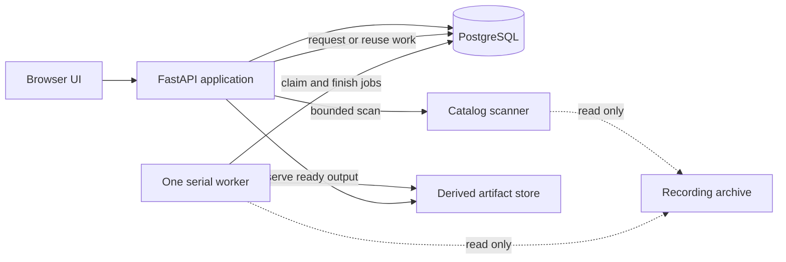

# ROS 2 Bag Analyser — Architecture

> **Status:** Accepted V0 architecture
>
> **Implementation status:** Building blocks 1–4 complete and user-accepted
>
> **Last updated:** 2026-07-22

This document defines the smallest architecture needed for the mentor-facing
V0. It is a build contract, not a description of existing software and not a
plan for a production platform.

## 1. V0 objective

The application must prove that one developer can build a safe web workflow
which:

1. scans the six known recording folders;
2. shows useful metadata and identifies the damaged ROS database;
3. generates and reuses a front-camera preview;
4. adds the timestamped top-down camera and synchronizes both videos; and
5. shows one IMU signal on the same timeline.

## 2. V0 decisions

| Area | Decision |
|---|---|
| Shape | Modular monolith in one repository |
| Backend | Python in the ROS 2 Humble environment |
| HTTP | FastAPI |
| Frontend | Browser UI consuming explicit HTTP responses |
| Persistent state | PostgreSQL with four small tables |
| Expensive work | One serial worker process |
| Source storage | External, configured, strictly read-only |
| Derived storage | Configured filesystem root outside the archive |
| Large outputs | Filesystem only, never PostgreSQL |
| ROS timeline | Record timestamp relative to bag start |
| Top-down timeline | CSV Unix timestamp relative to bag start |
| Telemetry | Configured standard IMU angular-velocity component |
| Authentication | Deferred; V0 is local or trusted-network only |
| Redis and brokers | Deferred |

PostgreSQL is retained because the API and worker need a small shared durable
state boundary. It is not permission to build a general job platform or a
future-proof catalog schema.

Framework, ORM, encoder, chart-library, bitrate, and styling choices are made
only in the roadmap block that first needs them.

## 3. Non-negotiable invariants

### 3.1 Original recordings are read-only

Sources are never modified, repaired, reindexed, renamed, moved, deleted, or
used as output locations. Source SQLite access is explicitly read-only and must
not create journals, WAL files, locks, indexes, or sidecars. Browser requests
refer to catalog IDs rather than arbitrary source paths. A read-only archive
mount is useful defence in depth but does not replace application checks.

### 3.2 Derived output has one owner

All generated output is constrained to a derived root that does not overlap the
archive. Discovered names cannot become unchecked paths. Work remains temporary
until validated and published; cleanup and replacement may affect only proven
derived-owned paths and must preserve valid earlier output on failure.

### 3.3 Heavy work is outside HTTP requests

A bounded metadata scan may run through an application service during an HTTP
request. Image decoding, transcoding, complete telemetry extraction, full
integrity checks, and other expensive work run in the serial worker.

### 3.4 Processing is independent of delivery

Scanning, ROS reading, image decoding, media generation, timestamp mapping, and
telemetry extraction do not import FastAPI or frontend code. They accept plain
validated inputs and return plain results.

### 3.5 Time has one meaning

Every synchronized stream uses elapsed time relative to the ROS bag start.
Backend calculations preserve integer nanoseconds. Header timestamps may be
retained for diagnostics but never silently replace the V0 record clock.

### 3.6 States describe one concern

Source condition, processing execution, and ready output are different facts.

- `unavailable` means prerequisites are missing, damaged, or unsupported.
- `failed` means an actual processing attempt failed.
- a ready artifact means validated output was published.

The UI may combine those facts into one display label. PostgreSQL does not store
the same lifecycle independently in several tables. Being outside a ready
stream's time coverage is a separate player condition, not a processing failure.

## 4. System shape



The API and worker are separate entry points from one backend package. The API
runs bounded catalog use cases and serves state/output; the scanner only
describes sources; and the worker runs one processor at a time. PostgreSQL holds
small metadata, the derived filesystem holds payloads, and the browser receives
neither ROS files nor absolute paths.

Scanner logic is independent of where it is dispatched. V0 may run its bounded
scan in the API process. If measurement later shows that scanning is too slow,
the same scanner can be called by the worker without changing its core logic or
result contract.

## 5. Small module boundaries

Create modules only when their roadmap block needs them.

| Boundary | Responsibility |
|---|---|
| `config` | Validate roots, database, topics, encoder, and server settings |
| `catalog` | Discover, parse metadata, inspect sources, and calculate revisions |
| `persistence` | Four PostgreSQL models and the direct queries V0 needs |
| `processors` | Front, top-down, and IMU processing from source descriptor to result |
| `artifact_store` | Cache keys, contained paths, temporary work, and publication |
| `timeline` | Integer time conversion, coverage, and global/media mapping |
| `api` / `worker` | Thin entry points which compose the other boundaries |

V0 does not need a repository framework, a generic domain package, or a job
framework. Image validation can remain inside the front processor until it is
genuinely shared. The frontend consumes API contracts, not database rows.

## 6. Configuration and paths

Building block 1 configures an existing readable `archive_root` and a separate
`derived_root`, validating that neither contains the other. Artifact-specific
directories and encoder checks wait until processing is introduced.

Add other settings only when used: PostgreSQL URL, front topic and supported
encoding, IMU topic and component, companion pairing rule, output profile, bind
address, and log level.

Paths and topics observed in the development archive are defaults or examples,
not constants embedded in core logic.

Validation rejects unusable roots, invalid settings, and required-service
failures at the point the setting or service is introduced.

## 7. Catalog scanning

### 7.1 Scanner contract

The scanner accepts validated configuration and returns plain recording and
component results. It performs no database writes.

A scan discovers recording directories, parses `metadata.yaml`, inventories
known components, performs bounded read-only health checks, and isolates errors
to one recording. It does not read complete streams or videos, parse entire
sidecars for display, hash the full archive, or generate/enqueue artifacts.

Header/file-size inconsistency and safe read failures detect the known truncated
database. The recording remains catalogued and its AVI/CSV remain visible.

### 7.2 Applying a scan

The catalog application service:

1. invokes the scanner;
2. applies the complete snapshot in a short PostgreSQL transaction;
3. upserts returned recordings by unique archive-relative path and component
   role.

There is no scan history. Removal and rename reconciliation are deferred; a
failed root scan does not erase the last complete catalog. Repeating an
unchanged scan preserves identities and matching artifacts and creates no jobs.

### 7.3 Source revision

A lightweight source revision uses relative names, sizes, high-resolution
mtimes, relevant metadata, and small SQLite header properties.

It is a practical cache key for the read-only development archive, not a claim
of cryptographic identity. Each processor narrows the revision to its own
inputs, so an unrelated CSV change does not invalidate a front preview.

## 8. PostgreSQL model

PostgreSQL contains exactly four V0 tables. Large media, bag content, extracted
frames, and telemetry payloads remain on the filesystem.

### 8.1 `recordings`

One row represents one recording directory. It stores an internal ID, unique
relative path, display metadata needed by the table/detail view, source revision,
and aggregate ROS health/diagnostic.

The API uses the internal ID. Absolute source paths are never public data.

### 8.2 `source_components`

One row describes a current metadata, ROS database, AVI, or CSV role. It stores
recording and role, relative path, size, mtime, condition, and a safe diagnostic.

A uniqueness constraint on recording and role is sufficient for the known V0
layout. General split-bag and arbitrary companion modeling are deferred.

### 8.3 `artifacts`

An artifact row exists only for validated output. It stores recording, kind,
unique cache identity, contained relative output path, MIME type, size, relevant
stream bounds, minimal manifest JSON, and creation time.

There is no artifact lifecycle state machine. A row matching the current cache
identity means ready. An older nonmatching row is not selected for current
playback. The ready file and manifest are revalidated before display or
delivery. If either is missing or inconsistent, the API reports failure; an
explicit retry transaction removes only that exact invalid row and queues a
replacement. Retention and stale-history UI are deferred.

### 8.4 `jobs`

A job row stores one processing attempt: ID, recording, artifact kind, cache
identity, `queued`/`running`/`succeeded`/`failed` state, timestamps, and safe
failure information.

The database prevents more than one active job for the same cache identity.
Request and completion transactions also take the same cache-identity advisory
lock, so completion cannot race a request into creating a redundant job.
V0 has no leases, heartbeat, attempt counter, automatic retry, cancellation,
priority, phase model, or percentage-progress contract.

### 8.5 Display-state resolution

The API derives the current UI state in this order:

1. missing, damaged, or unsupported prerequisites: `unavailable` with a reason;
2. matching ready artifact: `ready`;
3. matching active job: `queued` or `processing`;
4. most recent matching failed job: `failed`; or
5. otherwise: `not requested`.

`unavailable` never creates a failed job. A failed attempt never makes its
partial output an artifact.

## 9. Expensive work

### 9.1 Request flow

The API calculates the cache identity and checks prerequisites.

- If prerequisites are unavailable, it returns the reason without a job.
- If a matching artifact exists, it returns the ready artifact.
- If a matching job is active, it returns that job.
- Otherwise, it inserts one queued job and returns immediately.

This prevents a double-click or reload from starting duplicate extraction.

### 9.2 Serial worker

One worker polls PostgreSQL and runs one job at a time. A short transaction
marks the next queued job running; processing happens outside the transaction.

The worker reloads source descriptors, verifies identity, processes in a
temporary workspace, validates, rechecks relevant inputs, publishes, inserts
the ready row, and marks the job succeeded. A retry may replace a conflicting
app-owned artifact directory only after the replacement has passed validation;
the previous directory is retained until the validated rename succeeds.

On failure, it marks the job failed with a safe diagnostic. The user may request
a new attempt. V0 performs no automatic retry.

At startup, abandoned running jobs become failed/interrupted. Temporary work is
cleaned only after ownership is proven. V0 needs no lease recovery.

## 10. Artifact storage and reuse

### 10.1 Cache identity

A complete identity combines recording, artifact kind, relevant input revision,
processor version, and output-affecting inputs. It may be hashed into a safe
derived path; original filenames are never trusted as output paths.

### 10.2 Layout

Temporary and final output use contained, app-owned paths on the same filesystem
so publication can use atomic rename where practical.

### 10.3 Publication

The artifact store validates job-owned temporary output, writes its manifest,
publishes it, and only then inserts the ready row. Failure creates no ready
artifact and cannot affect a source.

### 10.4 Minimal manifest

The manifest records enough identity, settings, source-role, output, timing, and
validation information to inspect and reuse the artifact. The database is the
application index; neither location contains large payload data.

## 11. Time and synchronization

### 11.1 Canonical ROS time

V0 uses the bag start declared in metadata as the global origin. Readable record
timestamps may be compared with it for diagnostics but do not silently replace
it.

For each ROS message used by V0:

```text
bag_time_ns = record_timestamp_ns - bag_start_timestamp_ns
```

Backend domain logic uses signed integer nanoseconds. APIs serialize absolute
nanoseconds safely, for example as decimal strings. Conversion to floating-point
seconds occurs only at media and chart interfaces that require it.

### 11.2 Coverage

Every synchronized stream reports:

- start and end offsets relative to bag time;
- timestamp provenance;
- whether bounds are measured or inferred; and
- the mapping from global time to local media time.

The global V0 timeline spans the ROS recording. A camera or telemetry stream may
cover only part of it. Outside coverage, the UI shows an explicit
`outside coverage` pane rather than freezing a boundary frame and implying data
exists.

### 11.3 Front-camera mapping

Front frames use their ROS database record timestamps. If the first encoded
frame starts at `front_start_s`, then:

```text
front_media_time_s = global_time_s - front_start_s
```

Generated media must preserve recorded elapsed duration. It must not infer
duration solely from frame count and an assumed frequency.

Consequently, a gap in ROS record timestamps remains a visible hold in the
front preview even when message header stamps have a smoother cadence. That is
truthful record-clock behavior, not permission to substitute header time or an
assumed frame rate for smoother playback.

### 11.4 Top-down mapping

For top-down frame `i`:

```text
topdown_bag_time_ns[i] =
    csv_unix_timestamp_ns[i] - bag_start_timestamp_ns
```

CSV Unix timestamps are authoritative. The AVI's nominal frame rate is not
capture timing.

The derived media must make one second of media time represent one second of CSV
elapsed time. The chosen encoding strategy may use timestamp-aware timing or a
measured constant output rate, but it must preserve coverage and avoid
cumulative drift.

### 11.5 Browser ownership

The browser's global timeline owns play, pause, seek, and current bag-relative
time. Neither video is master for the other.

For each available stream:

```text
media_time_s = global_time_s - stream_start_s
```

The frontend advances global time from a monotonic browser clock, compares each
player with its desired media time, and corrects visible drift when a documented
tolerance is exceeded. The Building block 2 front player uses 100 milliseconds:
small decoder jitter is left alone, while larger divergence is corrected to the
global clock. Backend responsibilities end at timestamp-correct media, coverage,
and mapping data.

## 12. Processor boundaries

The roadmap owns each processor's supported inputs and acceptance tests. The
permanent architecture rules are:

- the front processor turns one configured ROS image stream into seekable media
  using record timestamps;
- the top-down processor validates the AVI/CSV pair and produces media timed by
  CSV timestamps; and
- the IMU processor extracts one configured standard field as bag-relative
  points, reducing data only when measured browser performance requires it.

Each processor returns coverage and provenance, works with bounded memory, and
reports malformed or unsupported input without changing sources. None owns a
playback clock; all outputs map to the global timeline.

### 12.1 Building block 2 front profile

The first front processor accepts the configured `sensor_msgs/msg/Image` topic
only when metadata and the SQLite topic row both report CDR serialization. It
supports `bgr8`, stable dimensions, bounded payloads, and one-row-at-a-time
message iteration from an immutable read-only SQLite connection. SQLite payload
length is checked before the BLOB is fetched or deserialized, bounding the
largest serialized image materialized by the processor.

The fixed `h264-720p-v1` output is MP4 with H.264/libx264, yuv420p, a maximum
size of 1280 × 720, CRF 23, the `veryfast` preset, and a one-microsecond media
timescale. Frames retain elapsed ROS record time; a frame is forced at least at
each available two-second keyframe boundary. If several messages have the same
record timestamp, the last image is encoded once and the collapse count is
recorded in the manifest.

Validation checks codec, pixel format, dimensions, size, encoded packet count,
elapsed duration, fast-start MP4 layout, and actual decoded output at
representative seeks with ffprobe/FFmpeg before publication. PyAV, its linked libraries, the processor version, input
identities, topic, and every output setting participate in the cache identity.

### 12.2 Building block 3 top-down profile

The top-down processor pairs the unique `topdown_video` and
`topdown_timestamps` components already catalogued for a recording. It requires
one `unix_timestamp` value per decoded AVI frame, parses at most nanosecond
precision without floating point, and rejects duplicate or unordered values.
Full CSV and AVI validation remains worker work; the scanner continues to
record companion presence only.

The processor decodes and encodes sequentially with one frame in flight. It
ignores nominal AVI timing and assigns each output frame a PTS from its CSV
timestamp relative to the first CSV timestamp. The output reuses the fixed
`h264-720p-v1` profile and publishes under the distinct `topdown_preview`
artifact kind. Its cache identity includes metadata timing, AVI and CSV file
identities, processor and encoder identities, and all output-affecting profile
settings. Declared dimensions are checked before frame decoding, the decoder
has an independent pixel ceiling, and decoded dimensions must remain stable.
Before publication, validation rescales every encoded video packet PTS to the
profile timescale and compares the complete ordered sequence with the
CSV-derived sequence produced by the processor.

Coverage is the first and last CSV timestamp relative to the bag start and is
never clipped to the global recording duration. The browser uses the existing
100-millisecond drift threshold for each player, force-seeks both players on an
explicit scrub, and hides an individual pane outside measured coverage.

### 12.3 Building block 4 IMU profile

The first IMU processor accepts one configured CDR `sensor_msgs/msg/Imu` topic
and the fixed `angular_velocity.z` component. It opens the catalogued SQLite
database through an immutable, explicitly read-only connection, verifies the
source identity and topic contract, checks serialized length before fetching a
BLOB, and deserializes one row at a time. It uses ROS database record timestamps
relative to the bag start; message header stamps do not replace that clock.

The derived artifact is bounded JSON with schema version 1 and ordered
`[bag_relative_nanoseconds, value]` samples. Nanoseconds are decimal strings so
the browser does not lose integer precision. Finite values are JSON numbers,
non-finite source values are explicit `null` gaps, and equal timestamps retain
database order. The cache identity includes source identities, bag timing,
topic/type/serialization, component, processor/schema versions, null and
duplicate policies, and the reduction decision.

V0 deliberately uses `reduction: none`. A 76,000-sample synthetic profile
measured a 2.76 MB payload, a 41 ms parse/validation, and a 6 ms Canvas draw in
headless Edge on the development host, so reduction was not justified. The
native Canvas trace maps bag-relative sample time to the full recording
duration. Its cursor and current value are read-only consumers of the existing
browser global clock; the graph does not own time or add click-to-seek.

## 13. Delivery contracts

The API exposes catalog, artifact, and timeline capabilities without leaking
database rows or filesystem paths. Front and top-down state/request operations
use GET and POST on `/api/recordings/{id}/front-preview` and
`/api/recordings/{id}/topdown-preview`. Each has a separate identity-specific
GET/HEAD media route with one browser byte range, strong validator, and
`If-Range` support. A stale artifact URL cannot resolve to a newer artifact.
IMU uses GET/POST `/api/recordings/{id}/imu-series` and an identity-specific
GET/HEAD JSON data route with the same contained-file, range, validator, and
stale-URL rules.
Scanner dispatch remains replaceable without changing its core contract, and
ready media supports seeking without a complete download.

## 14. Operational boundaries

V0 runs locally or on a trusted network and has no authentication. Public
exposure is out of scope. Resolved source and artifact paths must remain inside
their configured roots; browser errors omit paths and traces; external commands
use argument arrays; and data, credentials, and secrets stay out of Git.

Bounded scans, sequential source reads, one worker, bounded processor memory,
and exact artifact reuse are the V0 performance strategy. Logs, job errors, and
artifact metadata should identify the recording/processor, outcome, duration,
and output size. Measure before adding indexes, parallelism, caching layers,
metrics, tracing, dashboards, or other production operations infrastructure.

`ROADMAP.md` owns processor scope, exact verification, acceptance cases, and the
deferred backlog.
